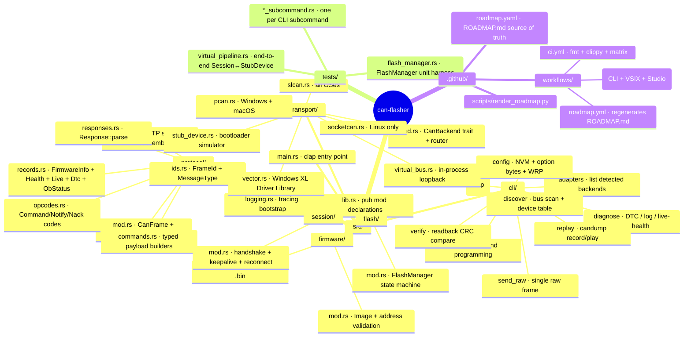
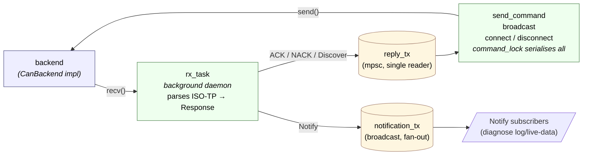

# Architecture

This document describes the current code layout of the `can-flasher`
host-side CLI — which modules exist, what they own, how they talk to
each other, and the design notes that belong one level above source
comments. Read [REQUIREMENTS.md](REQUIREMENTS.md) for **what** the tool
is supposed to do; read this file for **how** the Rust code fits
together today.

For delivery sequencing see [ROADMAP.md](ROADMAP.md).

---

## Module tree

Two sibling integration paths live alongside the core crate, each with
its own README:

- [`apps/can-studio/`](apps/can-studio/) — Tauri 2 desktop app that
  depends on the crate by path (no shell-out, no JSON parsing).
  Reuses `transport/`, `protocol/`, `flash/`, `firmware/`, `session/`
  directly; adds its own `bus_monitor.rs` + `dbc.rs` modules in its
  Tauri command surface.
- [`editor/vscode/`](editor/vscode/) — TypeScript VS Code extension
  that does shell out (it ships independently and may target any
  installed `can-flasher` binary), with vendored Chart.js for the
  live-data + health panels.

---

## Layers, from bottom to top

### 1. `protocol/` — wire format, zero I/O

Pure byte-shuffling and state machines. No transport dependencies, no
`tokio` types, nothing platform-specific. Every layout and constant
here matches the bootloader's `bl_proto.h` / `bl_isotp.h` /
`bl_fwinfo.h` / `bl_health.h` / `bl_live.h` / `bl_dtc.h` /
`bl_obyte.h` **byte-for-byte** — this module is the single place to
change if the wire format ever drifts.

Two policies for enums we emit vs. receive:

- **Strict** (`#[repr(u8)]` + `TryFrom<u8>`): [`CommandOpcode`],
  [`NotifyOpcode`], [`ResetMode`]. We never emit outside the known
  list, so unknown bytes at parse time are version-skew signals we
  surface loudly as errors.
- **Lenient** (enum with `Unknown(u8)` fallback): [`NackCode`]. A
  future bootloader that adds a NACK code should still land in the
  host's logs readably instead of crashing the flasher.

[`IsoTpSegmenter`] is a stateless iterator over 8-byte frames;
[`Reassembler`] is a state machine with a `feed(frame, now_ms)` +
`tick(now_ms)` API. Both documented in [`isotp.rs`'s module comment]
with the bootloader-specific conventions (FF keeps the original
`MessageType`, CFs travel as `TYPE=DATA`).

**Testing**: 80-odd in-file unit tests covering every edge case
(roundtrips, overflow, bad sequence, bad PCI, malformed records,
etc.). Zero reliance on external state.

### 2. `transport/` — adapter I/O behind an async trait

[`CanBackend`] is an `async-trait` trait with `send` / `recv` /
`set_bitrate` / `bus_load` / `has_hw_timestamps` / `description`
methods. Every backend implements it; callers consume it as
`Box<dyn CanBackend>` so the layer above doesn't care which adapter
actually shuffles frames.

Five backends ship today:

| Backend | Platform | Wire | Notes |
|---|---|---|---|
| `VirtualBackend` | all | in-proc `mpsc` | Paired into `VirtualBus` for testing; `StubLoopback` packages it with a `StubDevice` for the CLI's `--interface virtual` path. |
| `SlcanBackend` | Linux / macOS / Windows | USB CDC serial | Speaks SLCAN ASCII (`t` frames, `S<N>` bitrate, `O`/`C` open/close) via the `serialport` crate. Blocking reader thread + `tokio::sync::mpsc` for async recv. |
| `SocketCanBackend` | Linux | `AF_CAN` socket | `socketcan` crate with `tokio` feature. `cfg(target_os = "linux")`-gated. Also services `--interface pcan` on Linux since the `peak_usb` kernel module exposes PCAN as SocketCAN. |
| `PcanBackend` | Windows / macOS | PCAN-Basic SDK | `libloading` loads `PCANBasic.dll` / `libPCBUSB.dylib` at runtime. Missing SDK → `TransportError::AdapterMissing`, not a link error. Poll-based reader thread (1 ms between empty reads). |
| `VectorBackend` | Windows | XL Driver Library | `libloading` loads `vxlapi64.dll` at runtime; same fail-soft behaviour as PCAN. Channels enumerated via `xlGetDriverConfig`; the CLI takes a 0-based XL channel index. Linux support is planned. |

`TransportError` covers `Timeout` / `Disconnected` / `Io` /
`InvalidChannel` / `AdapterMissing` / `Other`. Every fallible method
on every backend returns `Result<T, TransportError>`.

[`open_backend`] is the router: takes `InterfaceType` + optional
channel string + bitrate, returns `Box<dyn CanBackend>`. Platform
gating lives there so the rest of the code stays platform-agnostic.

**In-process testing**: `VirtualBus` gives out two `VirtualBackend`
endpoints (host + device); `StubDevice` implements enough protocol
to answer `CONNECT` / `DISCONNECT` / `DISCOVER`, NACKing everything
else with `UNSUPPORTED`. Paired together they exercise the full
ISO-TP + protocol stack without any hardware.

### 3. `session/` — handshake, keepalive, notifications

One `Session` type on top of `CanBackend`. Bundles every piece of
boilerplate a subcommand would otherwise open-code:

- ISO-TP segmentation on TX (via [`IsoTpSegmenter`]).
- ISO-TP reassembly on RX in a **single background task** that owns
  the only read path into the backend. Captures
  [`MessageType`] from the SF/FF (since CFs ride as `TYPE=DATA` per
  the bootloader convention) and routes completed
  [`Response`]s:
  - `Ack` / `Nack` / `Discover` → `mpsc::Sender` (one receiver, owned
    by whoever holds `command_lock`)
  - `Notify` → `broadcast::Sender` (any number of subscribers)
- `CONNECT` handshake with protocol-version validation.
- 5 s keepalive task issuing `CMD_GET_HEALTH` to refresh the
  bootloader's 30 s session watchdog.
- Reconnect-on-`NACK(BAD_SESSION)`: under the same `command_lock`,
  so concurrent ops can't interleave mid-reconnect.
- Clean teardown: explicit `disconnect()` sends `CMD_DISCONNECT` and
  aborts the RX task; `Drop` does a best-effort version without
  being able to `.await`.

Exactly one command is in flight at a time — `command_lock`
(TokioMutex<()>) serialises `send_command`, `broadcast`, `connect`,
`disconnect`, and the reconnect-on-BAD_SESSION path.

### 4. `cli/` — subcommand implementations

Thin wrappers. Each subcommand:

1. Parses its own args via `clap`.
2. (For backend-needing subcommands) calls
   `transport::open_backend(…)` to get a `Box<dyn CanBackend>`.
3. (For session-needing subcommands) wraps in `Session::attach(…)`
   and calls `connect()`.
4. Issues one or more commands via
   `session.send_command(payload)` / `session.broadcast(…)`.
5. Formats the result as a human-readable table or JSON based on
   `--json`.

All eight subcommands are implemented as of v1.2.0 — `adapters`,
`discover`, `diagnose`, `config`, `verify`, `replay`, `flash`, and
`send-raw`. Each one is a thin wrapper around the protocol/session
layer; new commands typically take a few hundred lines including
their `--json` formatter and the integration test in
`tests/*_subcommand.rs`.

### 5. `main.rs` + `lib.rs` — binary + library targets

`src/lib.rs` declares the module tree as `pub mod`. `src/main.rs`
imports the same modules via `can_flasher::…`, parses CLI args,
dispatches to the subcommand's `run()` function, maps any
`anyhow::Error` to the exit codes in REQUIREMENTS.md §
Output and CI integration.

The split matters for two reasons:

1. **Integration tests** in `tests/` can only reach crate-library
   exports — binary-private `mod` declarations are invisible. `lib.rs`
   publishes everything the test suite needs.
2. **Future Rust consumers** (daemons, TUIs, scripts that prefer
   typed access over shelling out to the binary) can depend on
   `can_flasher` as a library crate without buying into the `clap`
   surface.

---

## Design notes

### Why `async-trait`?

[`CanBackend`] has async methods (`send`, `recv`, `set_bitrate`) and
is consumed as `Box<dyn CanBackend>`. Rust 1.75+ supports native
`async fn` in traits, but `dyn`-compatibility with native async
still requires desugaring into `Pin<Box<dyn Future>>` — which is
exactly what `async-trait` already does. One allocation per call,
zero bespoke machinery, easy for contributors to read.

If stable Rust ever ships a first-class dyn-safe async fn that
avoids the heap allocation, `async-trait` becomes a one-line `use`
removal.

### Why `mpsc` for the virtual bus instead of `broadcast`?

Classic CAN is a broadcast bus; every node sees every frame. At the
transport-mocking layer we emulate that with **two `mpsc` channels**
(host → device and device → host) instead of a single `broadcast`
channel for two reasons:

1. A broadcast channel would let a node see its own transmissions
   bounce back. We'd need per-node self-filtering to avoid loopback
   confusing the reassembler. Extra complexity that's not earning
   its keep at two nodes.
2. `broadcast` has bounded-buffer semantics where a slow receiver
   silently drops frames. `mpsc` surfaces that as a `TrySendError`
   we can map to a real `TransportError::Other`.

If we ever want multi-device virtual-bus tests (1 host + N stubs),
the natural move is a new `VirtualBus::broadcast_backend(node_id)`
that layers filtering on top of a `broadcast` channel — leaving the
existing 2-node path as a convenience shortcut.

### Why runtime dynamic loading for PCAN?

The PCAN-Basic SDK is proprietary; distributing a binary that
link-time-depends on it would force every user to install PEAK's
libraries before the flasher even starts up. That's tolerable for
PCAN users but absurd for everyone else. `libloading` resolves the
library at the moment `--interface pcan` is requested; everyone who
never touches PCAN never needs the SDK.

Search order (in priority):

1. `$PCAN_LIB_PATH` env var — explicit override.
2. Platform default (Windows: `PCANBasic.dll` via the OS-wide search
   path; macOS: `/usr/local/lib/libPCBUSB.dylib`).
3. Directory containing the currently-running binary.

Missing library surfaces as `TransportError::AdapterMissing` with
the PEAK download URL.

### Why the same pattern for Vector?

The Vector XL Driver Library (`vxlapi64.dll`) follows the identical
runtime-load story for the same reasons — it's a proprietary SDK
that absent users shouldn't have to install. `VectorBackend` loads
`vxlapi64.dll` via `libloading` on first `--interface vector` use,
with the search order:

1. `$VECTOR_LIB_PATH` env var — explicit override.
2. Bare `vxlapi64.dll` (Windows DLL search picks up the System32 copy
   that the Vector installer drops in).
3. Directory containing the currently-running binary.

Missing library surfaces as `TransportError::AdapterMissing` with the
Vector download URL.

One extra wrinkle vs PCAN: the XL Driver Library's `XLchannelConfig`
struct has changed layout across SDK releases. `vector.rs` treats the
config buffer as opaque bytes and reads only the fields it needs
(channel mask, channel index, bus capabilities, name) at documented
byte offsets. `XL_CHANNEL_CONFIG_SIZE` is the single tunable if a
future SDK ever shifts the slot stride. Adapter enumeration filters
by `channelBusCapabilities & XL_BUS_ACTIVE_CAP_CAN` so a multi-bus
device like the VN1640 (CAN + LIN) reports only its CAN channels.

Linux support is on the roadmap. Vector's Linux driver does not
currently expose adapters as SocketCAN interfaces (unlike PCAN's
`peak_usb`), so it'll need a separate code path rather than routing
through `SocketCanBackend`.

### Why `cfg`-gated platform modules?

The backends live in files that compile only on their supported
platforms:

- `transport/socketcan.rs` — `#![cfg(target_os = "linux")]`
- `transport/pcan.rs` — `#![cfg(any(target_os = "windows", target_os = "macos"))]`
- `transport/vector.rs` — `#![cfg(target_os = "windows")]`

The alternative (one file with inline `#[cfg]` everywhere) would
bloat each backend with platform-specific branches and prevent
contributors from reading a backend in isolation. The `cfg`-gated
file approach costs one extra dispatch arm in
[`open_backend`] but keeps each backend's implementation tight.

### Why the binary / library split?

Integration tests under `tests/` need to reach internals that would
otherwise be binary-private. Rather than re-exposing everything from
`main.rs` as `pub`, we build both a `can-flasher` binary and a
`can_flasher` library from the same sources: `lib.rs` publishes the
tree as `pub mod`, `main.rs` consumes via `can_flasher::…`.

Side effect: any future Rust consumer (a dashboard daemon, a CI
helper, a TUI) can depend on the library directly — no FFI, no
shell-out-and-parse-JSON path required. REQUIREMENTS.md frames the
CLI as the primary surface; the library is the escape hatch.

### Why `command_lock` serialises commands?

A CAN bus is shared. A bootloader session has one `session_active`
latch. Neither of those supports concurrent commands on the wire —
the bootloader would interleave responses and we'd have to match
replies to requests by opcode (with all the "what about duplicate
opcodes in flight?" edge cases that implies).

Serialising command issuance at the session layer matches the
physical reality. If a caller really wants concurrency (multi-node
flash: one `Session` per node running in parallel), they can spawn
one task per node — each task holds its own `Session` and its own
`command_lock`.

---

## Testing strategy

### Unit tests (in-file)

Every module declares a `#[cfg(test)] mod tests` with the tests that
exercise its public surface in isolation. Pure modules (protocol,
Session) land ~80-90 % of the total test count this way.

### Integration tests (`tests/`)

`tests/virtual_pipeline.rs` spins up a `VirtualBus` + `StubDevice` +
`Session` and asserts against the completed protocol round trip.
Exercises every layer simultaneously: frame IDs, ISO-TP segmentation
and reassembly, response parsing, session handshake, broadcast
collection.

### CI

`.github/workflows/ci.yml` runs:

- `rustfmt --check` (Linux)
- `clippy --all-targets --all-features -- -D warnings` (Linux — picks
  up the `socketcan` cfg path that macOS / Windows can't reach)
- `cargo build + test` on Linux, macOS, Windows

Linux needs `libudev-dev` + `pkg-config` for the `serialport` crate's
USB enumeration; installed inline in the workflow. No other
host-side requirements.

### Hardware-in-the-loop

Not automated. Opening a real `SlcanBackend` requires a CANable, a
real `SocketCanBackend` requires a kernel CAN interface, a real
`PcanBackend` requires a PEAK adapter plus the SDK. These paths are
covered by the manual smoke-test workflow: plug in, run
`can-flasher adapters` to see the expected entry, then run the
full flash / discover / diagnose cycle once they exist.

---

## Deferred / out of scope

Matches [REQUIREMENTS.md § Deferred scope](REQUIREMENTS.md#deferred-scope-v2-tied-to-bootloader-phase-5) —
these land if and when the bootloader reactivates its Phase 5
security work:

- Ed25519 firmware signing (`sign` / `keygen` subcommands)
- Monotonic replay counter
- Challenge-response session auth (adds `CMD_AUTH` wire surface)
- Optional AES-128-CTR transport encryption
- Device-UID-based identity

Nothing in the current code layout precludes bolting these on — the
Session type has hooks (pre-command / post-response) that can be
extended to carry signatures and nonces when the time comes.

---

## Where to start reading

- **Understanding the wire format**: `src/protocol/isotp.rs` module
  comment + `src/protocol/opcodes.rs`.
- **Adding a new backend**: `src/transport/slcan.rs` is the simplest
  full implementation; `src/transport/pcan.rs` and `src/transport/vector.rs`
  are the template if the backend talks to a proprietary SDK via
  `libloading`.
- **Adding a new subcommand**: `src/cli/adapters.rs` is the shortest
  one and `src/cli/discover.rs` is the canonical "open backend + drive
  session + format output" template.
- **Testing a new protocol feature**: `tests/virtual_pipeline.rs`
  plus the unit tests in the relevant module.
- **Changing the CLI args**: `src/cli/mod.rs` owns the `clap` types;
  each subcommand has its own `*Args` struct in its file.
