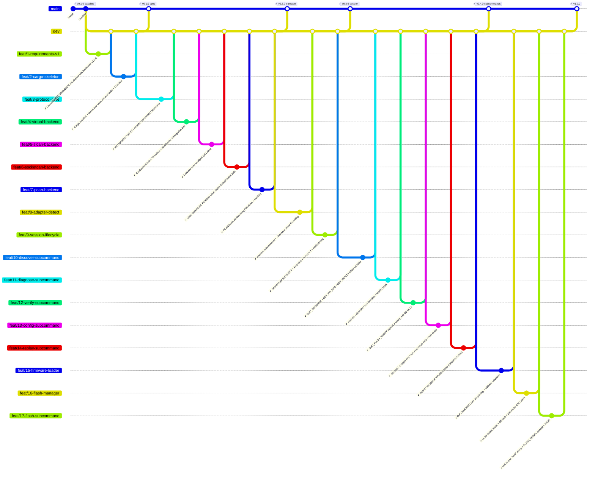

<!--
  Auto-generated from .github/roadmap.yaml by
  .github/scripts/render_roadmap.py. Do not edit this file directly —
  changes will be overwritten on the next run of the `Render ROADMAP`
  workflow. Edit the YAML or close / reopen a tracking issue instead.
-->

# Flasher roadmap

Production roadmap for the `can-flasher` host-side CLI. Each phase is
a cluster of feat branches cut from `dev`; a milestone tag on `main`
closes the phase once every branch in it has merged. Branch status
badges (✅ / 🔄 / 🔜) are derived from each branch's tracking issue
state in GitHub Issues.

The canonical spec lives in [REQUIREMENTS.md](REQUIREMENTS.md); the
module-level architecture notes live in
[ARCHITECTURE.md](ARCHITECTURE.md). This file tracks delivery
sequencing against the bootloader counterpart at
[isc-fs/stm32-can-bootloader](https://github.com/isc-fs/stm32-can-bootloader).

## Phase summary

| Phase | Title | Branches | Milestone tag |
|:---:|---|---|---|
| 1 | Spec + scaffolding | ✅ done `feat/1-requirements-v1` · ✅ done `feat/2-cargo-skeleton` | `v0.1.0-spec` |
| 2 | Protocol + transport | ✅ done `feat/3-protocol-core` · ✅ done `feat/4-virtual-backend` · ✅ done `feat/5-slcan-backend` · ✅ done `feat/6-socketcan-backend` · ✅ done `feat/7-pcan-backend` | `v0.2.0-transport` |
| 3 | Session + adapters subcommand | ✅ done `feat/8-adapter-detect` · ✅ done `feat/9-session-lifecycle` | `v0.3.0-session` |
| 4 | Remaining subcommands | ✅ done `feat/10-discover-subcommand` · ✅ done `feat/11-diagnose-subcommand` · ✅ done `feat/12-verify-subcommand` · ✅ done `feat/13-config-subcommand` · ✅ done `feat/14-replay-subcommand` | `v0.4.0-subcommands` |
| 5 | Flash pipeline | 🔜 planned `feat/15-firmware-loader` · 🔜 planned `feat/16-flash-manager` · 🔜 planned `feat/17-flash-subcommand` | `v1.0.0` |
| — | Plantilla sync _(sidequest)_ | ✅ done `feat/1-autoclose-on-dev-merge` · ✅ done `fix/1-workflow-titled-branches` | — |

## Branch diagram

---

## How this file is maintained

- **Source of truth**: [`.github/roadmap.yaml`](.github/roadmap.yaml)
- **Renderer**: [`.github/scripts/render_roadmap.py`](.github/scripts/render_roadmap.py)
- **Workflow**: [`.github/workflows/roadmap.yml`](.github/workflows/roadmap.yml)

The workflow runs on every push to `dev`. If any branch status changed
(a tracking issue was closed, the YAML was edited, a new branch was
added) it regenerates this file and auto-commits with the message
`chore: regenerate ROADMAP.md [skip ci]`.
