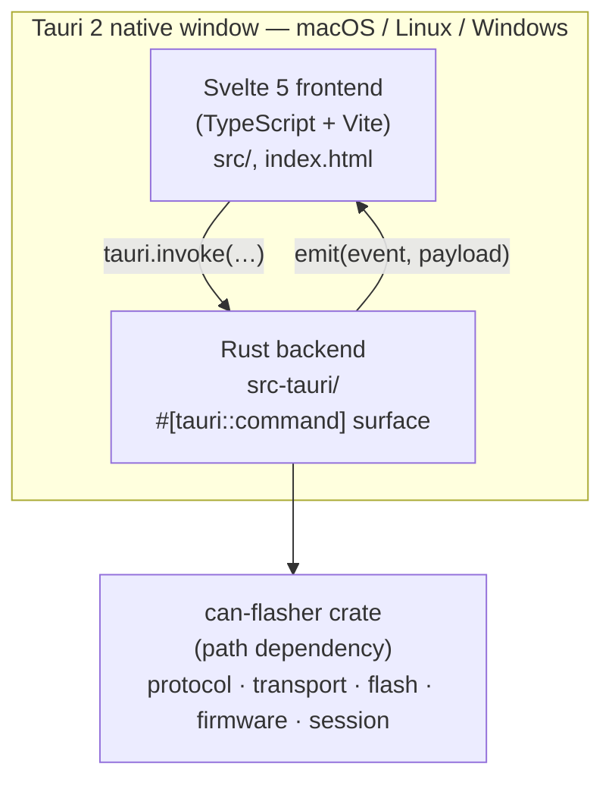
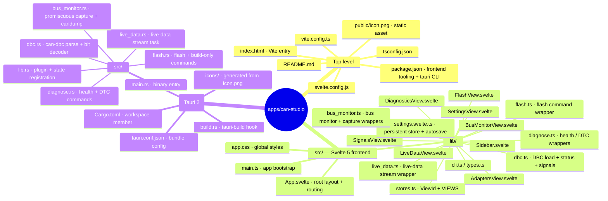

# ISC MingoCAN

Desktop application for **flashing, monitoring, and debugging CAN messages** on
the ISC Racing Team's Formula Student ECUs. The CLI ([`can-flasher`](../../README.md))
covers power-user / CI workflows; the [VS Code extension](../../editor/vscode/)
covers in-editor flashing for developers; this app is the surface for everyone
else — mechanics at a workbench, hardware engineers at a test bench, race-day
operators in the pit.

**Status: v0.3.0 — Tier 2 live.** Seven views in the sidebar — Adapters,
Flash, Diagnostics, Live data, Bus monitor, Signals, Settings — driving
real `can-flasher` functionality plus a generic CAN bus monitor with
candump-format capture-to-file and DBC-decoded signal display.
Per-view config + per-adapter DBC associations persist across restarts.

## Architecture



Same Rust on both sides of the IPC bridge — no shell-out tax, the bootloader
protocol code is reused directly. When a new adapter or a new opcode lands in
`can-flasher`, Studio picks it up by a Cargo bump.

## Tier roadmap

Same shape as the VS Code extension's evolution.

| Tier | Surface | Status |
|---|---|---|
| **0** | Adapters / Flash / Diagnostics / Live-data, persistent settings, native file pickers, Settings view | ✅ live (v0.1.0) |
| **1** | Generic CAN bus monitor — live frame list, filter by ID, per-ID rate, pause, capture-to-file | ✅ live (v0.2.1) |
| **2** | DBC file support — per-adapter DBC association, dedicated Signals view with live decoded values | ✅ live (v0.3.0); signal-trigger expressions deferred to v0.3.1 |
| **3** | Frame transmitter — single-shot + cyclic + signal-triggered sends | 🔜 |
| **4** | Record / replay sessions (candump format), multi-channel scope-style charts | 🔜 |

Tier 0 wraps existing CLI capability. Tier 1 was the inflection where Studio
became a real CAN tool — the bus monitor opens any of the five adapters in
promiscuous mode and streams every frame to the UI, independent of the
bootloader protocol. Tier 2 layered DBC decoding on top (per-adapter
`.dbc` association, decoded signal stream, dedicated Signals view).
Tier 3+ is on operator-feedback hold.

## Why Tauri

- Reuses the existing `can-flasher` Rust crates **by path dependency** — no
  shell-out, no JSON parsing of CLI output. Same wire-format code in CLI and
  app, can't drift.
- Native binaries on Mac, Linux, and Windows from one codebase (~10 MB each).
- Web frontend (Svelte 5 + Vite) iterates UI fast without learning a separate
  GUI toolkit.

## Why Svelte 5

- Smallest runtime among modern frameworks. Tauri's own examples lean Svelte.
- Component model is simple enough that anyone on the team can learn it.
- Reactive runes (`$state`, `$derived`, `$effect`) compose cleanly without the
  hooks dance.

## Development

### Prerequisites

- **Node 20+** and **npm** (for the frontend toolchain)
- **Rust 1.95+** with the `rustup` standard target — same toolchain as
  `can-flasher`
- Platform native deps for Tauri (Webkit/GTK on Linux, Xcode CLT on macOS,
  WebView2 on Windows). See <https://tauri.app/start/prerequisites/>.

### Dev loop

```bash
cd apps/can-studio
npm install                # one-time
npm run tauri:dev          # opens the dev window, HMR for the frontend,
                           # cargo-watch for the Rust side
```

### Release build

```bash
npm run tauri:build        # produces a platform-native bundle in
                           # src-tauri/target/release/bundle/
```

Outputs:
- macOS: `bundle/macos/ISC MingoCAN.app` and `bundle/dmg/*.dmg`
- Linux: `bundle/deb/*.deb`, `bundle/appimage/*.AppImage`, `bundle/rpm/*.rpm`
- Windows: `bundle/msi/*.msi`, `bundle/nsis/*.exe`

### Icon generation

The committed `src-tauri/icons/icon.png` is the source. **The Tauri build
script requires `icons/icon.ico` on Windows even for `cargo check`** — so
run the icon generator once after your first `npm install`:

```bash
npx tauri icon src-tauri/icons/icon.png
```

That produces `icon.ico` / `icon.icns` / `32x32.png` / `128x128.png` /
`128x128@2x.png` and a handful of store-metadata PNGs alongside the source.
All of those are `.gitignore`d so dev machines and CI regenerate them on
demand.

CI runs this step automatically before `cargo check` so the workflow is
self-contained.

## macOS Gatekeeper note

The macOS bundles are **ad-hoc signed** (`bundle.macOS.signingIdentity: "-"` in
`tauri.conf.json`) but not notarised through Apple — the team isn't paying for
the Developer Program. On first launch macOS Gatekeeper shows
*"… developer cannot be verified"*; the operator opens the app in `Applications`
via **right-click → Open → confirm** and subsequent launches work normally.

If Gatekeeper instead says *"… is damaged and can't be opened"* (typically
caused by a stale download or by an older bundle that pre-dates the ad-hoc
signing), strip the quarantine attribute manually:

```bash
xattr -dr com.apple.quarantine "/Applications/ISC MingoCAN.app"
```

The proper long-term fix is signing with an Apple Developer ID + notarising;
that's deferred until the friction warrants the $99/year + setup time.

## Releasing

From v2.0.0 onward Studio ships in lockstep with the CLI and the VS Code
extension under a single unified release. One `v*` tag triggers the
consolidated [`release.yml`](../../.github/workflows/release.yml)
workflow which builds all three surfaces in parallel and attaches every
artefact to one GitHub Release page.

Studio's contribution to the release: a 3-platform matrix that produces
the native bundles per OS — `.dmg` + `.app.tar.gz` (macOS), `.deb` +
`.AppImage` + `.rpm` (Linux), `.msi` + `.exe` (Windows). The verify-version
gate at the start of the workflow checks Studio's three version-of-truth
files (`src-tauri/Cargo.toml`, `package.json`, `src-tauri/tauri.conf.json`)
against the pushed tag alongside the CLI's `Cargo.toml` and the VS Code
extension's `package.json` — any mismatch fails the gate before any build
runs.

Manual dispatch (`Run workflow` button on the Actions UI) builds the bundles
as workflow artifacts without creating a Release — useful for testing a
build before tagging.

See [docs/CONTRIBUTING.md § Cutting a release](../../docs/CONTRIBUTING.md#cutting-a-release)
for the full step-by-step.

## Repository layout



## License

MIT — see [LICENSE](../../LICENSE) at the repo root.
