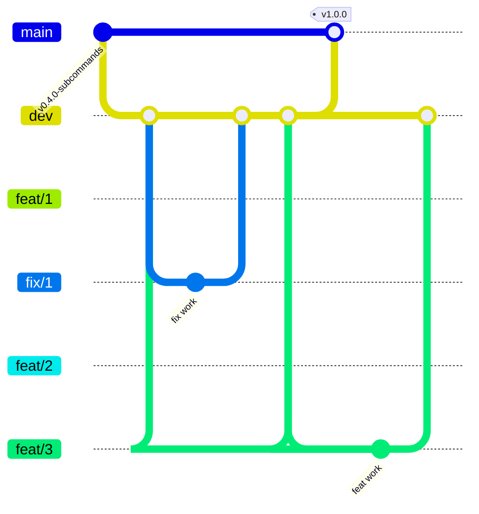

# Contributing to can-flasher

How the project is developed day-to-day: toolchain, test layout, CI,
branch conventions, how tracking issues and the roadmap stay in
sync. Read this before opening your first PR; the conventions aren't
obvious from looking at `git log` alone.

If you just want to *use* the flasher, see
[INSTALL.md](INSTALL.md) + [USAGE.md](USAGE.md).

---

## Development

### Toolchain

Pinned to the stable channel via `rust-toolchain.toml`; rustup auto-
installs the right version on first `cargo` invocation. Current MSRV
is **1.95**. `rustfmt` and `clippy` ship in the default profile.

### Common commands

```bash
cargo build                              # debug build
cargo build --release                    # optimised build (LTO, strip)
cargo test                               # full suite (lib + integration + doc)
cargo fmt                                # auto-format
cargo clippy --all-targets -- -D warnings  # lints as errors
```

### Test coverage

Three test flavours all run under `cargo test`:

- **Unit tests** in each module's `#[cfg(test)] mod tests { … }` — the
  bulk of the coverage (~90 % of tests). Pure functions, parsers,
  encoders.
- **Integration tests** under `tests/` — one file per subcommand plus
  `virtual_pipeline.rs` for the end-to-end stack. They spin up the
  `VirtualBus` + `StubDevice` + `Session` and round-trip commands
  through the full pipeline, or spawn the real binary via
  `CARGO_BIN_EXE_can-flasher` for CLI-contract tests.
- **Doc tests** in `///` blocks — currently one example in
  `protocol::commands`.

Hardware-in-the-loop (real CANable / SocketCAN / PCAN / Vector adapters) is
not part of CI; it's covered by the manual smoke-test workflow.

### CI

`.github/workflows/ci.yml` runs on every push to `dev` / `main` and
every PR into them:

- `rustfmt --check`
- `clippy --all-targets --all-features -- -D warnings`
- `build + test` matrix: Linux / macOS / Windows

Docs-only changes (README / REQUIREMENTS / ARCHITECTURE / ROADMAP /
`docs/**`) skip CI via path filters — no runner minutes for comment
tweaks.

---

## How we work with this repository

### Main branches



- `main` only advances when `dev` is merged at a release milestone — every commit on `main` corresponds to a tagged release.
- `dev` accumulates integration from per-branch PRs; nobody commits directly to it.
- Feature branches and fix branches are cut from `dev`, opened as PRs against `dev`, and squash-merged once CI passes.

`main` carries validated, tagged releases (`v0.x.0-…`, culminating
at `v1.0.0` and whatever comes next). `dev` is where feat / fix
branches integrate. Nobody commits directly to either.

#### Branch protection

`main` is protected at the GitHub level — not just by convention:

- **PR-required.** Direct `git push origin main` is rejected by
  the server; every commit on `main` must arrive through a
  merged PR.
- **No force-pushes.** Tagged release commits (`v1.3.1`,
  `v1.3.0`, …) can't be rewritten — by anyone, including repo
  admins (`enforce_admins: true`).
- **No deletion.** The branch can't be deleted from the API or
  the UI.

`dev` is intentionally **not** behind the PR-required gate
because [`release.yml`](../.github/workflows/release.yml)'s
inline `sync-dev` job needs to push to `dev` after a tag-cut
release (fast-forward dev onto main with the github-actions
bot's token; no PR feasible from a workflow run). Force-pushes
and deletion may still be locked down later via a Rulesets bot
bypass if direct pushes start to bite.

The repo also has **`delete_branch_on_merge: true`**, so
feat/fix branches auto-delete from origin the moment their PR
lands. No more lingering `feat/19-foo` on the branch list.

If you ever hit a "Required pull request is missing" or
"Protected branch update failed" error against `main`, you're
in the right state — open a PR instead.

### Branch naming

```
feat/<n>-<short-title>   new functionality  (feat/9-session-lifecycle, …)
fix/<n>-<short-title>    bug or doc fix      (fix/1-workflow-titled-branches, …)
```

`feat` and `fix` have independent counters — `feat/2` and `fix/2`
can coexist. The short kebab-case title is mandatory so the purpose
is visible at a glance.

### Tracking issues

Every branch auto-creates a GitHub Issue on its first push (via
`.github/workflows/branch-issue.yml`):

- Title: `[feat/N-short-title]` or `[fix/N-short-title]`
- Label: `feat` or `fix`
- Body: populated from the first commit's message

The issue closes automatically when the PR merges into `dev` (via
`.github/workflows/close-on-dev-merge.yml`). Closed issues form the
permanent history of the project — grepping them is how future
contributors see what's been done.

### Roadmap

[`../ROADMAP.md`](../ROADMAP.md) is **auto-generated** from
`.github/roadmap.yaml` by `.github/scripts/render_roadmap.py`. The
workflow runs on every push to `dev` and commits the regenerated
file if anything changed. Branch status badges come from the
tracking-issue state, so closed issues flip `🔜 planned` →
`✅ done` automatically.

Don't hand-edit `ROADMAP.md` — update the YAML instead.

### Typical workflow

```bash
# 1. Make sure dev is current
git checkout dev && git pull origin dev

# 2. Cut a branch (use the next feat/fix number + a short kebab title)
git checkout -b feat/10-discover-subcommand

# 3. Work, commit, push
git commit -m "short description"
git push origin feat/10-discover-subcommand

# 4. Open PR against dev (use `Closes #<issue>` in the body so the
#    tracking issue auto-closes on merge)
gh pr create --base dev --title "..." --body "Closes #NN …"

# 5. Squash-merge after review; the tracking issue closes itself
```

Phase boundaries (every few merged branches) trigger a `dev → main`
**merge commit** (not squash) + a milestone tag + a GitHub Release.
The roadmap table tracks which tag closes each phase.

### Cutting a release

When bumping `main` to a new version:

1. **Bump `Cargo.toml`** on `dev` first (`version = "1.1.2"` →
   `version = "1.2.0"`, or whatever the next tag will be). PR the
   bump + any last changes, merge to `dev`, then `dev → main`.
2. **Tag `main`** with `git tag -a v1.2.0 -m "…"` and push.
3. The `release.yml` workflow triggers on the tag push. Its first
   job (`verify-version`) compares the tag name minus the leading
   `v` against the `version` field in `Cargo.toml`. If they
   disagree, all build legs are skipped and you get a clear error
   pointing at the mismatch — retag after fixing the bump.

v1.1.0 shipped with a version skew bug (binaries reported
`can-flasher 0.1.0`); v1.1.1 added the CI guard so it can't
happen again. If you see the workflow fail on `verify-version`,
that's the guard earning its keep.

4. **Dev re-syncs automatically** once the release is published.
   `sync-dev-after-release.yml` listens for `release: published`
   and fast-forwards `dev` to `main` (or creates a merge commit
   if dev has diverged). No manual `git checkout dev && git merge
   main` needed after a release cut.

---

## Writing new code

A few conventions the codebase already follows — match them when
you add modules:

- **Module docs up top.** Every `pub mod` starts with a `//!`
  block that explains what the module does *and* what it doesn't
  do. Grep `src/` for `//!` to see examples. A reader coming to a
  file cold should understand the scope without leaving the file.
- **`ExitCodeHint` for CLI errors.** Subcommands return
  `anyhow::Error`s; attach an `ExitCodeHint` via `exit_err(hint,
  message)` when you want a specific process exit code. The hint
  sits in the error chain; `main.rs` walks it via `downcast_ref`.
  See `src/cli/mod.rs` for the enum and `src/cli/verify.rs` for an
  example.
- **Integration-test shape.** New subcommands get a
  `tests/<name>_subcommand.rs` file that spawns the real binary via
  `CARGO_BIN_EXE_can-flasher`; engine-level tests go next to the
  engine (`tests/flash_manager.rs`, `tests/virtual_pipeline.rs`).
  Keep subprocess tests for CLI contracts (args, exit codes,
  stdout shape) and in-process tests for behaviour.
- **Don't commit to `dev` or `main` directly.** Everything lands
  via a PR from a `feat/` or `fix/` branch.
- **No `Co-Authored-By` trailers.** Commits go out under the
  author's single authorship.

If your change warrants a test in the stub bootloader
(`src/transport/stub_device.rs`), extend it — the stub exists
specifically so integration tests can run without hardware.
