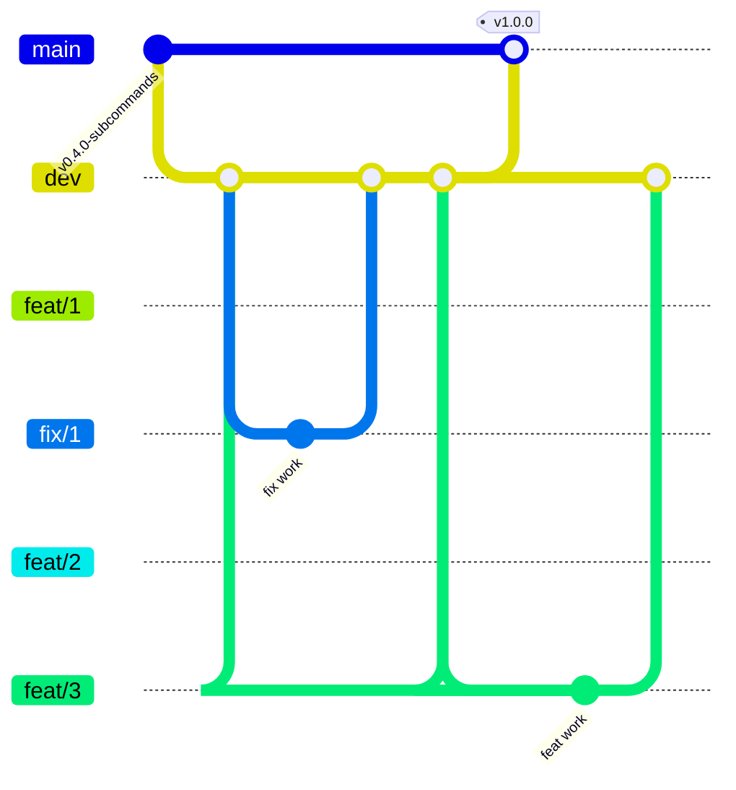

# Contributing to can-flasher

How the project is developed day-to-day: toolchain, test layout, CI,
branch conventions, how tracking issues and the roadmap stay in
sync. Read this before opening your first PR; the conventions aren't
obvious from looking at `git log` alone.

If you just want to *use* the flasher, see
[INSTALL.md](INSTALL.md) + [USAGE.md](USAGE.md).

---

## Development

### Toolchain

Pinned to the stable channel via `rust-toolchain.toml`; rustup auto-
installs the right version on first `cargo` invocation. Current MSRV
is **1.95**. `rustfmt` and `clippy` ship in the default profile.

### Common commands

```bash
cargo build                              # debug build
cargo build --release                    # optimised build (LTO, strip)
cargo test                               # full suite (lib + integration + doc)
cargo fmt                                # auto-format
cargo clippy --all-targets -- -D warnings  # lints as errors
```

### Test coverage

Three test flavours all run under `cargo test`:

- **Unit tests** in each module's `#[cfg(test)] mod tests { … }` — the
  bulk of the coverage (~90 % of tests). Pure functions, parsers,
  encoders.
- **Integration tests** under `tests/` — one file per subcommand plus
  `virtual_pipeline.rs` for the end-to-end stack. They spin up the
  `VirtualBus` + `StubDevice` + `Session` and round-trip commands
  through the full pipeline, or spawn the real binary via
  `CARGO_BIN_EXE_can-flasher` for CLI-contract tests.
- **Doc tests** in `///` blocks — currently one example in
  `protocol::commands`.

Hardware-in-the-loop (real CANable / SocketCAN / PCAN / Vector adapters) is
not part of CI; it's covered by the manual smoke-test workflow.

### CI

`.github/workflows/ci.yml` runs on every push to `dev` / `main` and
every PR into them:

- `rustfmt --check`
- `clippy --all-targets --all-features -- -D warnings`
- `build + test` matrix: Linux / macOS / Windows

Docs-only changes (README / REQUIREMENTS / ARCHITECTURE / ROADMAP /
`docs/**`) skip CI via path filters — no runner minutes for comment
tweaks.

---

## How we work with this repository

### Main branches



- `main` only advances when `dev` is merged at a release milestone — every commit on `main` corresponds to a tagged release.
- `dev` accumulates integration from per-branch PRs; nobody commits directly to it.
- Feature branches and fix branches are cut from `dev`, opened as PRs against `dev`, and squash-merged once CI passes.

`main` carries validated, tagged releases (`v0.x.0-…`, culminating
at `v1.0.0` and whatever comes next). `dev` is where feat / fix
branches integrate. Nobody commits directly to either.

#### Branch protection

`main` is protected at the GitHub level — not just by convention:

- **PR-required.** Direct `git push origin main` is rejected by
  the server; every commit on `main` must arrive through a
  merged PR.
- **No force-pushes.** Tagged release commits (`v1.3.1`,
  `v1.3.0`, …) can't be rewritten — by anyone, including repo
  admins (`enforce_admins: true`).
- **No deletion.** The branch can't be deleted from the API or
  the UI.

`dev` is intentionally **not** behind the PR-required gate
because [`release.yml`](../.github/workflows/release.yml)'s
inline `sync-dev` job needs to push to `dev` after a tag-cut
release (fast-forward dev onto main with the github-actions
bot's token; no PR feasible from a workflow run). Force-pushes
and deletion may still be locked down later via a Rulesets bot
bypass if direct pushes start to bite.

**Manual branch cleanup.** `delete_branch_on_merge` is
intentionally **off** at the repo level — see the post-mortem
note below. Use `gh pr merge --delete-branch` (or click "Delete
branch" in the GitHub UI after merge) to clean feat/fix branches
yourself. Long-lived branches (`dev`, `main`) must never be
auto-deleted.

> **Why off**: GitHub's `delete_branch_on_merge` flag is
> repo-wide and applies to *every* PR's head branch on merge,
> including the long-lived `dev` branch on a `dev → main`
> release PR. v2.0.0's release uncovered this — when PR #187
> (dev → main) merged with the flag on, GitHub silently deleted
> `dev`, and the inline `sync-dev` job in `release.yml` then
> failed at checkout because the branch it was trying to push to
> no longer existed. dev was restored from main (same SHA, no
> data loss), the flag was disabled, and the lesson stays in the
> repo's setting. There's no per-branch exclusion in classic
> branch protection; if we ever want a "delete except `dev` and
> `main`" rule, that's a Rulesets-tier project.

If you ever hit a "Required pull request is missing" or
"Protected branch update failed" error against `main`, you're
in the right state — open a PR instead.

### Branch naming

```
feat/<n>-<short-title>   new functionality  (feat/9-session-lifecycle, …)
fix/<n>-<short-title>    bug or doc fix      (fix/1-workflow-titled-branches, …)
```

`feat` and `fix` have independent counters — `feat/2` and `fix/2`
can coexist. The short kebab-case title is mandatory so the purpose
is visible at a glance.

### Tracking issues

Every branch auto-creates a GitHub Issue on its first push (via
`.github/workflows/branch-issue.yml`):

- Title: `[feat/N-short-title]` or `[fix/N-short-title]`
- Label: `feat` or `fix`
- Body: populated from the first commit's message

The issue closes automatically when the PR merges into `dev` (via
`.github/workflows/close-on-dev-merge.yml`). Closed issues form the
permanent history of the project — grepping them is how future
contributors see what's been done.

### Roadmap

[`../ROADMAP.md`](../ROADMAP.md) is **auto-generated** from
`.github/roadmap.yaml` by `.github/scripts/render_roadmap.py`. The
workflow runs on every push to `dev` and commits the regenerated
file if anything changed. Branch status badges come from the
tracking-issue state, so closed issues flip `🔜 planned` →
`✅ done` automatically.

Don't hand-edit `ROADMAP.md` — update the YAML instead.

### Typical workflow

```bash
# 1. Make sure dev is current
git checkout dev && git pull origin dev

# 2. Cut a branch (use the next feat/fix number + a short kebab title)
git checkout -b feat/10-discover-subcommand

# 3. Work, commit, push
git commit -m "short description"
git push origin feat/10-discover-subcommand

# 4. Open PR against dev (use `Closes #<issue>` in the body so the
#    tracking issue auto-closes on merge)
gh pr create --base dev --title "..." --body "Closes #NN …"

# 5. Squash-merge after review; the tracking issue closes itself
```

Phase boundaries (every few merged branches) trigger a `dev → main`
**merge commit** (not squash) + a milestone tag + a GitHub Release.
The roadmap table tracks which tag closes each phase.

### Cutting a release

**One tag, three surfaces, one Release page.** From v2.0.0 onward
the `can-flasher` CLI, the VS Code extension, and ISC CAN Studio
all ship together at the **same version** from a single `v*` tag
(e.g. `v2.0.0`). The retired `editor-v*` and `can-studio-v*` tag
namespaces are not used for new cuts; one tag triggers one
GitHub Release page carrying the CLI binaries, the VSIX, and the
Studio bundles side-by-side.

**No release branches.** Releases are tagged directly on `main`;
we don't cut `release/v*` branches at any point. Flow: land
everything on `dev`, fast-forward `dev → main`, tag on `main`.

When cutting `vX.Y.Z`, bump **all five** source-of-truth files
in the same commit on `dev`:

| File | Field |
|---|---|
| `Cargo.toml` (root) | `version = "X.Y.Z"` |
| `Cargo.lock` | `can-flasher` package entry's `version = "X.Y.Z"` |
| `editor/vscode/package.json` | `"version": "X.Y.Z"` |
| `apps/can-studio/src-tauri/Cargo.toml` | `version = "X.Y.Z"` |
| `apps/can-studio/package.json` | `"version": "X.Y.Z"` |
| `apps/can-studio/src-tauri/tauri.conf.json` | `"version": "X.Y.Z"` |

Then:

1. PR the bump + any last changes to `dev`; merge.
2. Open a `dev → main` release PR and merge it.
3. Tag `main` with `git tag -a vX.Y.Z -m "…"` and push.
4. The consolidated [`release.yml`](../.github/workflows/release.yml)
   triggers. Its `verify-version` gate compares the tag's
   `X.Y.Z` against all five source files. Any mismatch fails the
   gate by file name, and all build legs skip — retag after
   bumping.

The five-way gate is the descendant of v1.1.0's version-skew
lesson (v1.1.0 binaries reported `can-flasher 0.1.0`; v1.1.1
added the original single-file guard). The current gate catches
the same class of mistake across all three surfaces in lockstep.

5. **Three build legs run in parallel** under the single
   workflow:
   - `cli-build` matrix → 4 binary archives (Linux x86_64 /
     aarch64, macOS aarch64, Windows x86_64)
   - `editor-build` → one `.vsix`
   - `studio-build` matrix → 7 native bundles (`.dmg`,
     `.app.tar.gz`, `.deb`, `.AppImage`, `.rpm`, `.msi`, `.exe`)

   All twelve assets land on **one** GitHub Release page, named
   after the tag.

6. **Dev re-syncs automatically.** The inline `sync-dev` job in
   `release.yml` fast-forwards `dev` to `main` (or creates a
   merge commit if dev has diverged) once all three build legs
   succeed. The standalone `sync-dev-after-release.yml` workflow
   stays as a manual-dispatch recovery handle for the rare case
   where the inline job didn't run.

7. **Edit the Release notes on GitHub** with the per-surface
   "what's new" highlights. The auto-generated body sets up the
   install snippets for each surface; the operator-facing summary
   of *changes* lives in your handwriting on top.

---

## Writing new code

A few conventions the codebase already follows — match them when
you add modules:

- **Module docs up top.** Every `pub mod` starts with a `//!`
  block that explains what the module does *and* what it doesn't
  do. Grep `src/` for `//!` to see examples. A reader coming to a
  file cold should understand the scope without leaving the file.
- **`ExitCodeHint` for CLI errors.** Subcommands return
  `anyhow::Error`s; attach an `ExitCodeHint` via `exit_err(hint,
  message)` when you want a specific process exit code. The hint
  sits in the error chain; `main.rs` walks it via `downcast_ref`.
  See `src/cli/mod.rs` for the enum and `src/cli/verify.rs` for an
  example.
- **Integration-test shape.** New subcommands get a
  `tests/<name>_subcommand.rs` file that spawns the real binary via
  `CARGO_BIN_EXE_can-flasher`; engine-level tests go next to the
  engine (`tests/flash_manager.rs`, `tests/virtual_pipeline.rs`).
  Keep subprocess tests for CLI contracts (args, exit codes,
  stdout shape) and in-process tests for behaviour.
- **Don't commit to `dev` or `main` directly.** Everything lands
  via a PR from a `feat/` or `fix/` branch.
- **No `Co-Authored-By` trailers.** Commits go out under the
  author's single authorship.

If your change warrants a test in the stub bootloader
(`src/transport/stub_device.rs`), extend it — the stub exists
specifically so integration tests can run without hardware.
